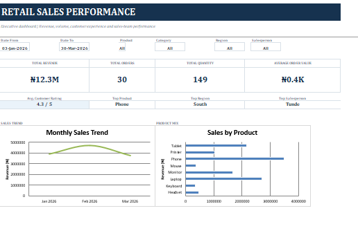

# Retail Sales Performance Dashboard

## Project Overview

The **Retail Sales Performance Dashboard** is an Excel-based data analysis and visualization project designed to provide a clear overview of retail sales performance.

The dashboard transforms raw retail transaction data into meaningful business insights using KPI cards, charts, and Excel-based analysis.

The entire project was developed in **Microsoft Excel** and does not require Power BI, macros, or external data connections.

## Dataset Overview

The dataset contains **30 retail sales transactions** covering the period **January to March 2026**.

## Dashboard Preview

### Dataset Columns

| Column | Description |
|---|---|
| Order_ID | Unique identification number for each order |
| Date | Date of the transaction |
| Product | Product sold |
| Category | Product category |
| Region | Region where the sale occurred |
| Salesperson | Salesperson responsible for the sale |
| Quantity | Number of units sold |
| Unit_Price | Selling price per unit |
| Sales_Amount | Total revenue generated from the transaction |
| Customer_Rating | Customer rating for the transaction |

## Key Performance Indicators

- **Total Revenue:** ₦12,258,000
- **Total Orders:** 30
- **Total Quantity Sold:** 149
- **Average Order Value:** ₦408,600
- **Average Customer Rating:** 4.3/5

## KPI Calculations

### Total Revenue

**Total Revenue = Sum of Sales Amount**

### Total Orders

**Total Orders = Number of Sales Transactions**

### Total Quantity

**Total Quantity = Sum of Quantity Sold**

### Average Order Value

**Average Order Value = Total Revenue ÷ Total Orders**

### Average Customer Rating

**Average Customer Rating = Average of Customer Ratings**

## Dashboard Visualizations

The dashboard contains six major visualizations.

### 1. Monthly Sales Trend

Shows the movement of sales revenue across:

- January 2026
- February 2026
- March 2026

### 2. Sales by Product

Compares the revenue generated by each individual product.

### 3. Sales by Category

Shows the contribution of each product category to total sales revenue.

### 4. Sales by Region

Compares sales revenue across the different regions.

### 5. Salesperson Performance

Shows the sales revenue generated by each salesperson.

### 6. Customer Rating by Product

Compares the average customer rating received for each product.

## Workbook Structure

The Excel workbook contains three worksheets.

### Dashboard

The main presentation sheet containing:

- KPI cards
- Monthly sales trend
- Sales by product
- Sales by category
- Sales by region
- Salesperson performance
- Customer rating by product

### Sales Data

Contains the original retail transaction records in a structured Excel table.

This sheet can be used to:

- Review individual transactions
- Filter records
- Check source data
- Perform additional analysis

### Chart Data

Contains the summarized data used to generate the dashboard charts.

Keeping the chart source data in a separate worksheet ensures that the Excel charts have stable data ranges.

## How to Use the Workbook

1. Open the Excel workbook using **Microsoft Excel**.
2. Start from the **Dashboard** worksheet.
3. Review the KPI cards at the top.
4. Examine the six charts for sales trends and performance.
5. Go to the **Sales Data** worksheet to inspect individual transactions.
6. Review the **Chart Data** worksheet to see the summarized information supporting the visualizations.

## Data Limitation

The dataset contains sales revenue information but does not contain:

- Product cost
- Cost of Goods Sold (COGS)
- Operating expenses
- Administrative expenses
- Selling expenses

Therefore, the following metrics cannot be reliably calculated from the available dataset:

- Gross Profit
- Net Profit
- Gross Profit Margin
- Net Profit Margin

The dashboard therefore focuses on **sales performance, revenue, quantity, customer ratings, products, regions, and salesperson performance**.

## Key Business Insights

- Total revenue generated was **₦12.258 million**.
- The business recorded **30 sales transactions**.
- A total of **149 units** were sold.
- Average Order Value was **₦408,600**.
- Average customer rating was **4.3 out of 5**.
- February 2026 recorded the highest monthly sales revenue.
- Electronics generated the largest share of revenue.
- Phones were among the highest-revenue products.
- Regional and salesperson analysis provides useful comparisons of sales performance.

## Tools and Technologies

**Primary Tool:** Microsoft Excel

### Techniques Used

- Data cleaning
- Data aggregation
- Excel Tables
- Excel formulas
- KPI calculations
- Excel Charts
- Data visualization
- Dashboard design
- Business insight generation

## Project Objective

The objective of this project is to demonstrate how raw retail transaction data can be transformed into a professional **Excel-based sales dashboard** that provides a clear view of business performance and supports data-driven analysis.

## Project Details

| Item | Details |
|---|---|
| Project Type | Retail Sales Data Analysis |
| Platform | Microsoft Excel |
| Dataset Size | 30 Transactions |
| Analysis Period | January–March 2026 |
| Currency | Nigerian Naira (₦) |

## Author

**Enioluwa Olu-Ajimati**

This project demonstrates the application of **data analysis, Excel visualization, and financial/business insight generation** to retail sales data.
